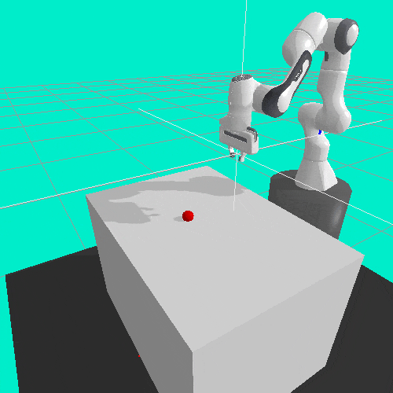
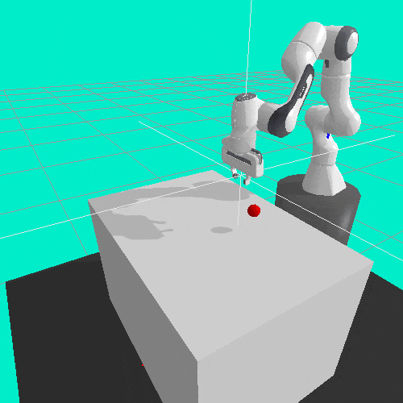
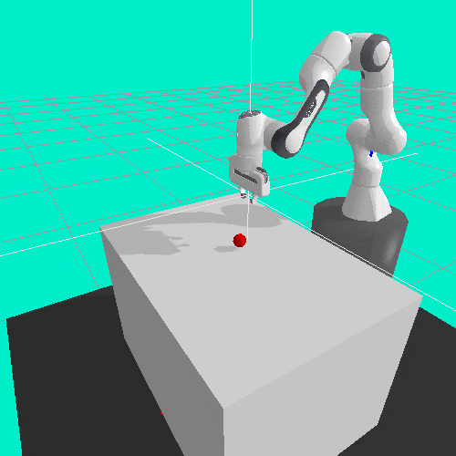
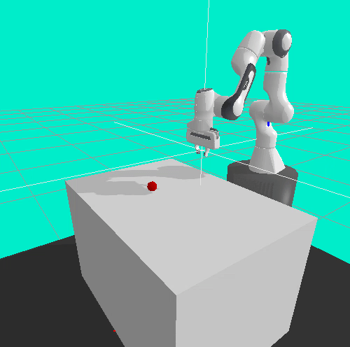
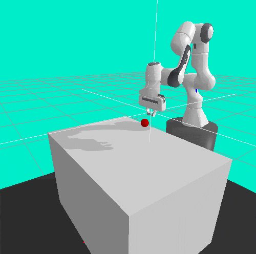

OpenaAI Gym robot reaching environment with PyBullet.

This a (sort-of) port of the **fetch_reach_v1** environment featured in this [article](https://openai.com/blog/ingredients-for-robotics-research/) which I wanted to try for my RL experiments but I did not have a [Mujoco](http://mujoco.org) license.

Anyway, here is the env in action, agent was trained with PPO. 

| | Agent performance at different training episodes | |
|:-------------------------:|:-------------------------:|:-------------------------:|
||||
||||

## Install

Install with `pip`:

    git clone https://github.com/mcarfagno/gym-panda-reach
    cd gym-panda-reach
    pip install .

## Basic Usage 

Example running of the environment:

```python
import gym
import gym_panda_reach
env = gym.make('panda-reach-v0')
env.reset()
env.reward_type = "sparse" #default is "dense"
for _ in range(100):
    env.render()
    obs, reward, done, info = env.step(
        env.action_space.sample()) # take a random action
env.close()
```
References and Special Thanks:
* [Mahyar Abdeetedal](https://github.com/mahyaret) -> awesome [tutorial](https://www.etedal.net/2020/04/pybullet-panda.html) and [inspiration](https://github.com/mahyaret/gym-panda)
* [OpenAI]() -> original [environment](https://github.com/openai/gym/tree/master/gym/envs/robotics/fetch)
* [PyBullet](pybullet.org) -> my favourite robotics simulator, sorry gazebo
